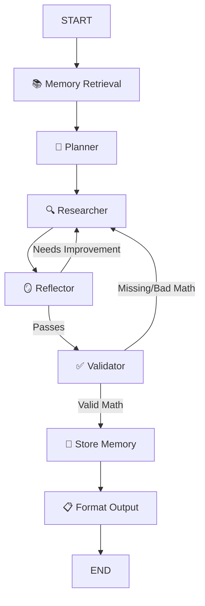

# Autonomous Research Agent - 

A production-ready, highly autonomous research agent built with **LangGraph**, **Groq** (LLM), **Pinecone** (vector memory), **DuckDuckGo** (search), and **FastAPI** (API deployment).

## Problem Statement

Financial analysts and market researchers spend hours manually gathering data from multiple reports, standardizing it, and running calculations (like CAGR) to deduce market trends. This agent automates the entire pipeline: it searches the web in real-time, extracts historical data, securely runs Python code to compute mathematical formulas, self-corrects if data is missing, and synthesizes everything into a structured JSON report. 

## Architecture

The system uses an advanced cyclic graph built with **LangGraph** to allow continuous reflection and self-correction.



**Technical Workflow:**
1. **Memory Retrieval:** Queries Pinecone vector database using Sentence Transformers to inject past contextual research.
2. **Planner Node:** Deconstructs the user query into a logical, step-by-step execution plan.
3. **Researcher Node:** Acts autonomously by utilizing **DuckDuckGo** for real-time data and a **Python REPL** tool for robust mathematical execution.
4. **Reflector & Validator Nodes (Self-Correction):** The system critiques its own draft. The Validator strictly checks if mathematically-required queries actually executed valid Python code (e.g., catching zero-division errors). If it fails, it loops back to the Researcher with specific `FIX_INSTRUCTIONS`.
5. **Memory Store & Output:** Saves the validated response back to Pinecone and formats the final payload using Pydantic JSON schemas.

## Quick Start

### 1. Setup
```bash
# Install dependencies (into existing agents venv)
agents\Scripts\pip.exe install -r requirements.txt

# Create .env with your API keys
# GROQ_API_KEY=gsk_...
# PINECONE_API_KEY=pcsk_...
# PINECONE_INDEX_NAME=research-agent
```

### 2. Run Tests (Phase by Phase)
```bash
# Set encoding for Windows
$env:PYTHONIOENCODING='utf-8'

python tests/test_phase1_llm.py        # LLM check
python tests/test_phase2_tools.py      # Tools check
python tests/test_phase3_memory.py     # Pinecone check
python tests/test_phase4_agents.py     # Agent functions
python tests/test_phase5_graph.py      # Full pipeline
python tests/test_phase7_schema.py     # Structured output
```

### 3. Run Agent (CLI)
```bash
python run_agent.py "What caused the 2008 financial crisis?"
```

### 4. Run API Server
```bash
python -m uvicorn src.api:app --host 127.0.0.1 --port 8000
```

Then visit:
- **Swagger UI**: http://localhost:8000/docs
- **Health**: http://localhost:8000/health
- **Query**:
```bash
curl -X POST http://localhost:8000/query -H "Content-Type: application/json" -d '{"query": "What are the latest AI trends?"}'
```

## Project Structure

```
LumiqAI/
├── src/
│   ├── config.py      # Environment variables & constants
│   ├── llm.py         # Groq LLM initialization
│   ├── tools.py       # DuckDuckGo + Python REPL
│   ├── memory.py      # Pinecone vector memory
│   ├── agents.py      # Planner, Research, Reflection agents
│   ├── graph.py       # LangGraph workflow orchestration
│   ├── schemas.py     # Pydantic output models
│   └── api.py         # FastAPI endpoints
├── tests/             # Phase-by-phase test scripts
├── .env               # API keys (gitignored)
├── requirements.txt   # Dependencies
├── run_agent.py       # CLI entry point
├── Procfile           # Render deployment
└── README.md
```

## Output Schema

```json
{
  "query": "string",
  "summary": "string",
  "key_findings": ["string"],
  "sources": ["string"],
  "confidence": 0.0-1.0,
  "needs_further_research": true/false
}
```

## Deployment (Render)

1. Push to GitHub
2. Connect repo on [render.com](https://render.com)
3. Set environment variables: `GROQ_API_KEY`, `PINECONE_API_KEY`, `PINECONE_INDEX_NAME`
4. Build command: `pip install -r requirements.txt`
5. Start command: `uvicorn src.api:app --host 0.0.0.0 --port $PORT`

## Limitations & Future Work

### Limitations
1. **LLM Data Parsing Fragility:** The Python REPL mathematical execution heavily relies on the LLM's ability to parse scraped, unstructured web data into standardized variables. If 2020 EV data is formatted variably across reports, the agent requires heavy reflection loops to fix variable names before calculation succeeds.
2. **API Rate Limits:** Reliant on open/free-tier Groq API instances resulting in slight waiting periods.

### Future Improvements
1. **Data Sanitization Node:** Introduce a dedicated parsing node directly before the Python Executor that solely standardizes retrieved numerical data format using Pydantic, bridging the gap between raw web search and code execution.
2. **Secure Sandboxing:** Sandbox the internal Python code executor with technologies like E2B to prevent runaway or unsafe scripts when moving to enterprise deployments.
